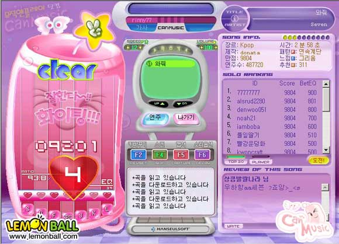
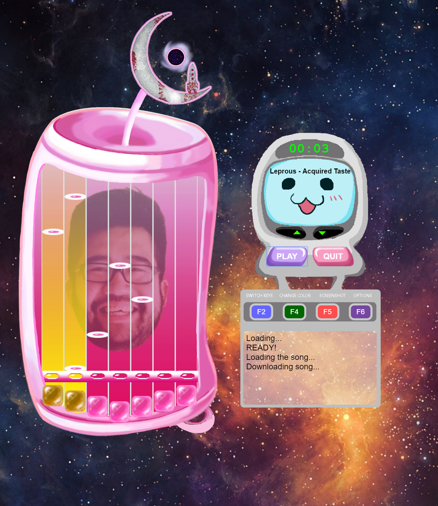

# djent_can_music
Reenacting the old Korean rhythm game 'Canmusic' specifically for prog metal and djent songs

# Plans:
This is the first time I am developing a rhythm game from scratch, currently I am catching up on how to process music files and algorithms needed for frequencies.
So far, I know that I will be using C/C++ for back end architectures, I'd like to organize the framework in OOP principles as much as possible. 
I started getting the 'conductor' class that will be responsible for keeping beats per minute/user hit/mp3 metadata buffer/which point in the song currently the user is in etc.
Hopefully eventually it can process .mp3 AND .wav files but starting from processing .wav file first. I'm gonna create all the UI that looks similar to original UI via Photoshop/Illustrator.
Djent/Prog metal is really wonky with time signatures, so I'll make 4/4 songs work first and then customize the structure to accustom more weird time signatures.

# Update:

I got most of the UI done, all the keyboard inputs are recognizable now. Drew the frame of can myself for copyright issue avoidance!
